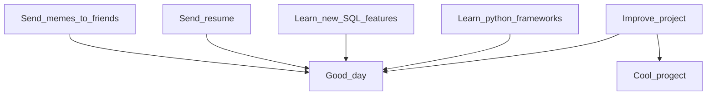

# Hi there, I'm Oleg

  <picture>
    <source media="(prefers-color-scheme: dark)" srcset="https://cdn.jsdelivr.net/gh/devicons/devicon@latest/icons/python/python-original-wordmark.svg">
    
  </picture>
  
  <picture>
    <source media="(prefers-color-scheme: dark)" srcset="https://cdn.jsdelivr.net/gh/devicons/devicon@latest/icons/postgresql/postgresql-original.svg">
    
  </picture>
  
  <picture>
    <source media="(prefers-color-scheme: dark)" srcset="https://cdn.jsdelivr.net/gh/devicons/devicon@latest/icons/fastapi/fastapi-original-wordmark.svg">
    
  </picture>

  <picture>
    <source media="(prefers-color-scheme: dark)" srcset="https://cdn.jsdelivr.net/gh/devicons/devicon@latest/icons/elasticsearch/elasticsearch-plain-wordmark.svg">
    
  </picture>

  <picture>
    <source media="(prefers-color-scheme: dark)" srcset="https://cdn.jsdelivr.net/gh/devicons/devicon@latest/icons/sqlalchemy/sqlalchemy-original-wordmark.svg">
    
  </picture>

  <picture>
    <source media="(prefers-color-scheme: dark)" srcset="https://cdn.jsdelivr.net/gh/devicons/devicon@latest/icons/docker/docker-original-wordmark.svg">
    
  </picture>
  
  <picture>
    <source media="(prefers-color-scheme: dark)" srcset="https://static.djangoproject.com/img/logos/django-logo-negative.svg">
    
  </picture>
  
  <picture>
    <source media="(prefers-color-scheme: dark)" srcset="https://cdn.jsdelivr.net/gh/devicons/devicon@latest/icons/mysql/mysql-original-wordmark.svg">
    
  </picture>

  <picture>
    <source media="(prefers-color-scheme: dark)" srcset="https://cdn.jsdelivr.net/gh/devicons/devicon@latest/icons/pytest/pytest-original-wordmark.svg">
    
  </picture>

  <picture>
    <source media="(prefers-color-scheme: dark)" srcset="https://cdn.jsdelivr.net/gh/devicons/devicon@latest/icons/postman/postman-original-wordmark.svg">
    
  </picture>  

  <picture>
    <source media="(prefers-color-scheme: dark)" srcset="https://cdn.jsdelivr.net/gh/devicons/devicon@latest/icons/insomnia/insomnia-original-wordmark.svg">
    
  </picture>  

  <picture>
    <source media="(prefers-color-scheme: dark)" srcset="https://qwantum.ru/wp-content/uploads/2023/05/cypress-light.svg">
    
  </picture>  

  <picture>
    <source media="(prefers-color-scheme: dark)" srcset="https://cdn.jsdelivr.net/gh/devicons/devicon@latest/icons/selenium/selenium-original.svg">
    
  </picture>  

  <picture>
    <source media="(prefers-color-scheme: dark)" srcset="https://cdn.jsdelivr.net/gh/devicons/devicon@latest/icons/confluence/confluence-original-wordmark.svg">
    
  </picture>  
  
  <picture>
    <source media="(prefers-color-scheme: dark)" srcset="https://www.svgrepo.com/show/217753/github.svg">
    
  </picture>

  <picture>
    <source media="(prefers-color-scheme: dark)" srcset="https://cdn.jsdelivr.net/gh/devicons/devicon@latest/icons/gitlab/gitlab-plain-wordmark.svg">
    
  </picture>

  <picture>
    <source media="(prefers-color-scheme: dark)" srcset="https://cdn.jsdelivr.net/gh/devicons/devicon@latest/icons/swagger/swagger-original.svg">
    
  </picture>

  <picture>
    <source media="(prefers-color-scheme: dark)" srcset="https://www.svgrepo.com/show/373726/kivy.svg">
    
  </picture>

  <picture>
    <source media="(prefers-color-scheme: dark)" srcset="https://icon.icepanel.io/Technology/png-shadow-512/Apache-Kafka.png">
    
  </picture>

  <picture>
    <source media="(prefers-color-scheme: dark)" srcset="https://cdn.jsdelivr.net/gh/devicons/devicon@latest/icons/pycharm/pycharm-original.svg">
    
  </picture>
  

  
Ссылка для переключения на [Русский](https://github.com/Dopelen/Dopelen/blob/main/README.ru.md)

I’m writing a README — you know, so you can read me.

In the drop down menu below you can see my projects (the headings are hyperlinks to repositories, feel free to click).

  
🚀 <b>Projects</b>

  ### 1️⃣ [Product Categories](https://github.com/Dopelen/Product_categories)
  A microservice for in-store order processing

  **Tech stack:** Python, FastAPI, PostgreSQL, Asyncpg, Docker, Alembic, SQLAlchemy, Pydantic

  ### 2️⃣ [Balance Application](https://github.com/Dopelen/balance_application)
  A microservice for managing user balances through transactions

  **Tech stack:** Python, FastAPI, PostgreSQL, gRPC, Asyncpg, Docker, Alembic, SQLAlchemy, Pydantic

  ### 3️⃣ [Warehouse Monitoring Service](https://github.com/Dopelen/warehouse-monitoring-service)
  A warehouse monitoring service using an event broker

  **Tech stack:** Python, FastAPI, PostgreSQL, Aiokafka, Asyncpg, Docker, SQLAlchemy, Pydantic

  ### 4️⃣ [FastAPI Template](https://github.com/Dopelen/fastapi-template)
  A FastAPI application template

  **Tech stack:** Python, FastAPI, PostgreSQL, Aiokafka, Asyncpg, Docker, SQLAlchemy, Pydantic

  ### 5️⃣ [Testing Templates](https://github.com/Dopelen/testing-templates)
  Test templates and connection setups for integration testing

  **Tech stack:** Python, Pytest, Elasticsearch

  ### 6️⃣ [CheckIPer](https://github.com/Dopelen/CheckIPer__Kivy__)
  A program for monitoring the status of devices on a network by pinging them with a flexible timer

  **Tech stack:** Python, Kivy

  ### 7️⃣ [Weatherman](https://github.com/Dopelen/Weatherman__Django__)
  A website for getting weather forecasts via API and generating weather charts in Django

  **Tech stack:** Python, JavaScript, CSS, Django, Matplotlib, Pandas, Plotly

  ### 8️⃣ [School](https://github.com/Dopelen/School__FastAPI-PostgreSQL__)
  A school database management system

  **Tech stack:** Python, FastAPI, SQLAlchemy, Pydantic, Pytest

  ### 9️⃣ [Models for Game](https://github.com/Dopelen/Models_for_game)
  A service for calculating bonuses in a game with downloadable information about them

  **Tech stack:** Python, SQLite, SQLAlchemy, Pytest

  ### 🔟 [Phone Book](https://github.com/Dopelen/Phone_book__Python__)
  A console-based telephone directory interface

  **Tech stack:** Python

  
🧩 <b>Algorithm Challenges</b>

  ### 1️⃣ [LeetCode](https://github.com/Dopelen/Solved-problems)
  My solutions for thousands of algorithmic problems
  
  **Tech stack:** Python

  ### 2️⃣ [AdventOfCode2024](https://github.com/Dopelen/AdventOfCode2024)
  My solutions to problems at the annual AdventOfCode algorithmic problem event
  
  **Tech stack:** Python

## Here's a checklist to monitor my progress in life:

- [x] Learn the basics of Python  
- [x] Learn data structures  
- [x] Learn relational databases  
- [x] Learn popular frameworks like Django and FastAPI  
- [x] Learn to write tests  
- [x] Create a flowchart  
- [x] Create my [**GitHub account**](https://github.com/Dopelen?tab=repositories) to host my projects and algorithmic solutions from LeetCode  
- [x] [Solve all free easy algorithmic problems available](https://leetcode.com/u/Oleg_Ab/)  
- [x] Lose a 100-day streak on LeetCode because solving a task on June 2 (local time) doesn’t count as June 2 in LeetCode’s time zone  
- [x] Build my cool [***project***](https://github.com/Dopelen/CheckIPer) with a GUI and animations  
- [x] Study, build projects, and write tests ([all on GitHub](https://github.com/Dopelen?tab=repositories))  
- [x] Get a job
- [x] Learn how to interact with databases using ORM
- [x] Read the entire Elasticsearch documentation to improve flexible search at work and solve mapping issues  
- [x] Develop a microservice as part of a microservice architecture, while automating the testing system for the entire project
- [x] Design flexible tests with full synthetic data generation to easily reuse them across multiple work environments with minimal effort
- [x] Create a data import system based on Excel templates generated for users
- [x] Successfully investigate and resolve 50 production bugs!
- [x] Take on the role of a team lead for a three-person testing group
- [x] Achieve full integration and end-to-end test coverage for all project endpoints
- [ ] Solve all hard algorithmic problems available  
- [ ] Learn every framework in the world  
- [ ] Find a new job  

## **Here is my plan**:

| My current status: |
|:----|
|Actively looking for a new job — ready for the next big thing|
|500+ days of daily LeetCode — still counting, still debugging|
|Building new stuff, breaking old stuff, fixing both|
|Learning how to make LLMs useful instead of just impressive|
|Deep-diving into Python async to make every millisecond count|
|Leveling up in testing — because bugs fear full coverage|

