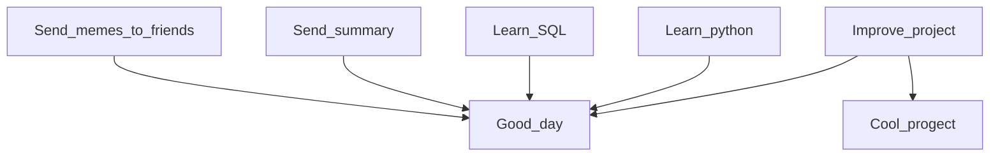

# Hi there, I'm Oleg

<picture>
  <source media="(prefers-color-scheme: dark)" srcset=
</a>
</picture>  

| |  | <picture><source media="(prefers-color-scheme: dark)" srcset="https://github.com/Dopelen/Dopelen/assets/141639888/c7a02e7c-7a40-462e-b165-cab4c15821a2" width="100" height="100"></picture> |  |
|---|---|---|---|

I testing README where you can read ME...you know

I'll leave a checklist here to monitor my progress in life
- [x] Create checklist
- [x] Create table
- [x] Create a flow chart
- [x] Make my own cool project (feel free to [***check it***](https://github.com/Dopelen/CheckIPer))
- [x] [***And another one***](https://github.com/Dopelen/Phone_book)
- [x] Make a visual for it
- [ ] Find a job

**Here is my plan**:

| My current status |
|:----|
|I’m working on finding a job but this is long road, so at the same time|
|I'm learning SQL and advanced data structures|
|I'm making my own program to monitor network performance|
|You can ask me about everything, but quality of the answer will vary|
|Fun fact: Our intestines are essentially empty space, and a person is a formation around it|

