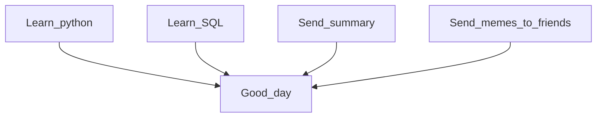

# Hi there, I'm Oleg

I testing README where you can read ME...you know

I'll leave a checklist here to monitor my progress in life
- [x] Create checklist
- [x] Create table
- [x] Create a flow chart
- [ ] Find a job

**Here is my plan**:

| My current status |
|:----|
|I’m working on finding a job but this is long road, so at the same time|
|I'm learning SQL and advanced data structures|
|You can ask me about everything, but quality of the answer will vary|
|Fun fact: Our intestines are essentially empty space, and a person is a formation around it|

