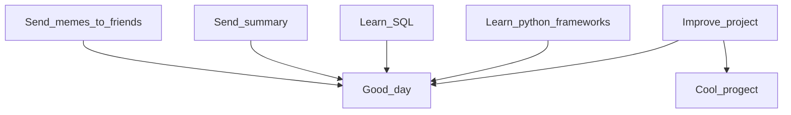

# Hi there, I'm Oleg

  <picture>
    <source media="(prefers-color-scheme: dark)" srcset="https://cdn.jsdelivr.net/gh/devicons/devicon@latest/icons/python/python-original-wordmark.svg">
    
  </picture>
  
  <picture>
    <source media="(prefers-color-scheme: dark)" srcset="https://cdn.jsdelivr.net/gh/devicons/devicon@latest/icons/postgresql/postgresql-original.svg">
    
  </picture>
  
  <picture>
    <source media="(prefers-color-scheme: dark)" srcset="https://cdn.jsdelivr.net/gh/devicons/devicon@latest/icons/fastapi/fastapi-original-wordmark.svg">
    
  </picture>

  <picture>
    <source media="(prefers-color-scheme: dark)" srcset="https://cdn.jsdelivr.net/gh/devicons/devicon@latest/icons/elasticsearch/elasticsearch-plain-wordmark.svg">
    
  </picture>

  <picture>
    <source media="(prefers-color-scheme: dark)" srcset="https://cdn.jsdelivr.net/gh/devicons/devicon@latest/icons/sqlalchemy/sqlalchemy-original-wordmark.svg">
    
  </picture>

  <picture>
    <source media="(prefers-color-scheme: dark)" srcset="https://cdn.jsdelivr.net/gh/devicons/devicon@latest/icons/docker/docker-original-wordmark.svg">
    
  </picture>
  
  <picture>
    <source media="(prefers-color-scheme: dark)" srcset="https://static.djangoproject.com/img/logos/django-logo-negative.svg">
    
  </picture>
  
  <picture>
    <source media="(prefers-color-scheme: dark)" srcset="https://cdn.jsdelivr.net/gh/devicons/devicon@latest/icons/mysql/mysql-original-wordmark.svg">
    
  </picture>

  <picture>
    <source media="(prefers-color-scheme: dark)" srcset="https://cdn.jsdelivr.net/gh/devicons/devicon@latest/icons/pytest/pytest-original-wordmark.svg">
    
  </picture>

  <picture>
    <source media="(prefers-color-scheme: dark)" srcset="https://cdn.jsdelivr.net/gh/devicons/devicon@latest/icons/postman/postman-original-wordmark.svg">
    
  </picture>  

  <picture>
    <source media="(prefers-color-scheme: dark)" srcset="https://cdn.jsdelivr.net/gh/devicons/devicon@latest/icons/insomnia/insomnia-original-wordmark.svg">
    
  </picture>  

  <picture>
    <source media="(prefers-color-scheme: dark)" srcset="https://qwantum.ru/wp-content/uploads/2023/05/cypress-light.svg">
    
  </picture>  

  <picture>
    <source media="(prefers-color-scheme: dark)" srcset="https://cdn.jsdelivr.net/gh/devicons/devicon@latest/icons/selenium/selenium-original.svg">
    
  </picture>  

  <picture>
    <source media="(prefers-color-scheme: dark)" srcset="https://cdn.jsdelivr.net/gh/devicons/devicon@latest/icons/confluence/confluence-original-wordmark.svg">
    
  </picture>  
  
  <picture>
    <source media="(prefers-color-scheme: dark)" srcset="https://www.svgrepo.com/show/217753/github.svg">
    
  </picture>

  <picture>
    <source media="(prefers-color-scheme: dark)" srcset="https://cdn.jsdelivr.net/gh/devicons/devicon@latest/icons/gitlab/gitlab-plain-wordmark.svg">
    
  </picture>

  <picture>
    <source media="(prefers-color-scheme: dark)" srcset="https://cdn.jsdelivr.net/gh/devicons/devicon@latest/icons/swagger/swagger-original.svg">
    
  </picture>

  <picture>
    <source media="(prefers-color-scheme: dark)" srcset="https://www.svgrepo.com/show/373726/kivy.svg">
    
  </picture>

  <picture>
    <source media="(prefers-color-scheme: dark)" srcset="https://icon.icepanel.io/Technology/png-shadow-512/Apache-Kafka.png">
    
  </picture>

  <picture>
    <source media="(prefers-color-scheme: dark)" srcset="https://cdn.jsdelivr.net/gh/devicons/devicon@latest/icons/pycharm/pycharm-original.svg">
    
  </picture>
  

      
Ссылка для переключения на [Русский](https://github.com/Dopelen/Dopelen/blob/main/README.ru.md)

I am testing README where you can read ME...you know

Here's a checklist to monitor my progress in life
- [x] Learn the basics of Python
- [x] Learn data structures
- [x] Learn relational databases
- [x] Learn popular frameworks like Django and FastAPI
- [x] Learn to write tests
- [x] Create a flow chart
- [x] Create my [**GitHub account**](https://github.com/Dopelen?tab=repositories) in which I will put my projects and solutions to algorithmic problems from leetcode
- [x] [Solve all free simple algorithmic problems that exist](https://leetcode.com/u/Oleg_Ab/)
- [x] Losing a streak of 100 consecutive days of solving problems because Leetcode says 'task solved on June 2' does not mean it is counted as solved on June 2. Due to time zones, a task solved in your location on June 2 may still be June 1 in the time zone used by Leetcode.
- [x] Made my cool [***project***](https://github.com/Dopelen/CheckIPer) with GUI and animations
- [x] Study, do projects, write tests ([all on GitHub](https://github.com/Dopelen?tab=repositories))
- [ ] Solve all hard algorithmic problems that exist
- [ ] Learn all the frameworks in the world
- [ ] Find a job

**Here is my plan**:

| My current status: |
|:----|
|I’m working on finding a job but this is long road, so at the same time|
|learning PostgreSQL and advanced data structures|
|learning FastAPI and Django|
|constantly implementing and improving my projects|
|You can ask me about anything, but the quality of the answer may vary|
|Fun fact: Why does fish smell so bad, it washes all its life...|

