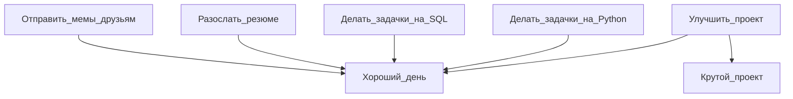

# Добро пожаловать, меня зовут Олег

<picture>
  <source media="(prefers-color-scheme: dark)" srcset=
</a>
</picture>  

| |  | <picture><source media="(prefers-color-scheme: dark)" srcset="https://github.com/Dopelen/Dopelen/assets/141639888/c7a02e7c-7a40-462e-b165-cab4c15821a2" width="100" height="100"></picture> |  |
|---|---|---|---|

Link to [English](https://github.com/Dopelen/Dopelen/blob/main/README.md) version

Это мой профиль, в котором можно найти ссылки на мои проекты, аккаунты в других местах и какую-то информацию обо мне.

Я создал чеклист, чтобы примерно отслеживать свой жизненный прогресс
- [x] Создать чеклист
- [x] Создать таблицу c иконками моих компетенций
- [x] Создать блок-схему
- [x] Сделать свой собственный проект (обязательно оцените [***тыкать сюда***](https://github.com/Dopelen/CheckIPer))
- [x] [***И даже ещё один для консоли***](https://github.com/Dopelen/Phone_book)
- [x] Сделать визуал с помощью Kivy
- [x] Написать тесты
- [ ] Найти работу

**В целом сценарий такой**:

| Мой текущий статус |
|:----|
|Активно ищу работу, но это долгий путь, так что я не трачу время и прокачиваю свои hard skills со всех сторон|
|Повышаю свои знания в SQL и учу advanced data structures в Python|
|Сделал сврю программу для мониторинга работы сети и визуал для неё, ввожу новый функционал шаг за шагом|
|Меня можно спрашивать о чем угодно, но качество ответов это другой вопрос|
|Fun fact: Кольчуга для кролика это крольчуга|

