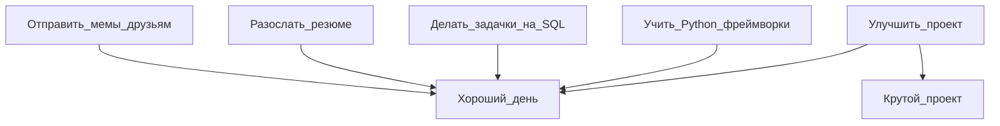

# Добро пожаловать, меня зовут Олег

<picture>
  <source media="(prefers-color-scheme: dark)" srcset="https://readme-typing-svg.demolab.com?font=Tektur&size=30&duration=4000&pause=10000&color=67C454&background=111222&center=true&vCenter=true&random=false&width=500&lines=_вот-вот_программист.__doc__" alt="Typing SVG" /></a>
</a>
</picture>  

  <picture>
    <source media="(prefers-color-scheme: dark)" srcset="https://cdn.jsdelivr.net/gh/devicons/devicon@latest/icons/python/python-original-wordmark.svg">
    
  </picture>
  
  <picture>
    <source media="(prefers-color-scheme: dark)" srcset="https://cdn.jsdelivr.net/gh/devicons/devicon@latest/icons/postgresql/postgresql-original.svg">
    
  </picture>
  
  <picture>
    <source media="(prefers-color-scheme: dark)" srcset="https://cdn.jsdelivr.net/gh/devicons/devicon@latest/icons/fastapi/fastapi-original-wordmark.svg">
    
  </picture>
  
  <picture>
    <source media="(prefers-color-scheme: dark)" srcset="https://static.djangoproject.com/img/logos/django-logo-negative.svg">
    
  </picture>
  
  <picture>
    <source media="(prefers-color-scheme: dark)" srcset="https://cdn.jsdelivr.net/gh/devicons/devicon@latest/icons/mysql/mysql-original-wordmark.svg">
    
  </picture>

  <picture>
    <source media="(prefers-color-scheme: dark)" srcset="https://cdn.jsdelivr.net/gh/devicons/devicon@latest/icons/pytest/pytest-original-wordmark.svg">
    
  </picture>

  <picture>
    <source media="(prefers-color-scheme: dark)" srcset="https://www.svgrepo.com/show/217753/github.svg">
    
  </picture>

  <picture>
    <source media="(prefers-color-scheme: dark)" srcset="https://www.svgrepo.com/show/373726/kivy.svg">
    
  </picture>

  <picture>
    <source media="(prefers-color-scheme: dark)" srcset="https://cdn.jsdelivr.net/gh/devicons/devicon@latest/icons/pycharm/pycharm-original.svg">
    
  </picture>
  

Link to [English version](https://github.com/Dopelen/Dopelen/blob/main/README.md) 

Это мой профиль, в котором можно найти ссылки на мои проекты, аккаунты на других площадках и какую-то информацию обо мне.

Вот чеклист, чтобы примерно отслеживать мой жизненный прогресс:
- [x] Создать чек-лист
- [x] Изучить Python 
- [x] Изучить структуры данных
- [x] Изучить реляционные базы данных
- [x] Углубиться в изучение фреймворков на Python (FastAPI и Django)
- [x] Научиться писать тесты 
- [x] Создать блок-схему
- [x] Создать свой [**GitHub аккаунт**](https://github.com/Dopelen?tab=repositories), куда я буду складывать свои проекты и решения алгоритмических задач с leetcode
- [x] Сделать свой собственный [***проект***](https://github.com/Dopelen/CheckIPer) с GUI
- [x] [Решить все существующие легкие бесплатные задачи на Leetcode](https://leetcode.com/u/Oleg_Ab/)
- [x] Потерять серию из 100 последовательных дней решения задач на Leetcode потому что "задача решена второго июня" не значит, что она решена второго июня. Интерфейс Leetcode отображает информацию деталей отправки решения, исходя из вашего часового пояса, но высчитывает границы дней, относительно своего.
- [x] Продолжать учиться, делать проекты и писать тесты ([всё на GitHub](https://github.com/Dopelen/CheckIPer))
- [ ] Решить все существующие сложные алгоритмические задачи
- [ ] Изучить все фреймворки мира 
- [ ] Найти работу

**В целом сценарий такой**:

| Мой текущий статус: |
|:----|
|Активно ищу работу, но это долгий путь, так что я не трачу своё время и прокачиваю свои компетенции со всех сторон|
|Повышаю знания в PostgreSQL и изучаю продвинутые структуры данных в Python|
|Учу FastAPI и Django|
|Делаю различные проекты и улучшаю те, что есть|
|Меня можно спрашивать о чем угодно, но качество ответа может варьироваться|
|Забавный факт: Кольчуга для кролика это крольчуга|

