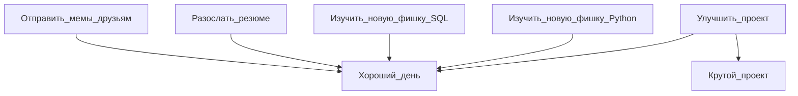

# Добро пожаловать, меня зовут Олег

  <picture>
    <source media="(prefers-color-scheme: dark)" srcset="https://cdn.jsdelivr.net/gh/devicons/devicon@latest/icons/python/python-original-wordmark.svg">
    
  </picture>
  
  <picture>
    <source media="(prefers-color-scheme: dark)" srcset="https://cdn.jsdelivr.net/gh/devicons/devicon@latest/icons/postgresql/postgresql-original.svg">
    
  </picture>
  
  <picture>
    <source media="(prefers-color-scheme: dark)" srcset="https://cdn.jsdelivr.net/gh/devicons/devicon@latest/icons/fastapi/fastapi-original-wordmark.svg">
    
  </picture>

  <picture>
    <source media="(prefers-color-scheme: dark)" srcset="https://cdn.jsdelivr.net/gh/devicons/devicon@latest/icons/elasticsearch/elasticsearch-plain-wordmark.svg">
    
  </picture>

  <picture>
    <source media="(prefers-color-scheme: dark)" srcset="https://cdn.jsdelivr.net/gh/devicons/devicon@latest/icons/sqlalchemy/sqlalchemy-original-wordmark.svg">
    
  </picture>

  <picture>
    <source media="(prefers-color-scheme: dark)" srcset="https://cdn.jsdelivr.net/gh/devicons/devicon@latest/icons/docker/docker-original-wordmark.svg">
    
  </picture>
  
  <picture>
    <source media="(prefers-color-scheme: dark)" srcset="https://static.djangoproject.com/img/logos/django-logo-negative.svg">
    
  </picture>
  
  <picture>
    <source media="(prefers-color-scheme: dark)" srcset="https://cdn.jsdelivr.net/gh/devicons/devicon@latest/icons/mysql/mysql-original-wordmark.svg">
    
  </picture>

  <picture>
    <source media="(prefers-color-scheme: dark)" srcset="https://cdn.jsdelivr.net/gh/devicons/devicon@latest/icons/pytest/pytest-original-wordmark.svg">
    
  </picture>

  <picture>
    <source media="(prefers-color-scheme: dark)" srcset="https://cdn.jsdelivr.net/gh/devicons/devicon@latest/icons/postman/postman-original-wordmark.svg">
    
  </picture>  

  <picture>
    <source media="(prefers-color-scheme: dark)" srcset="https://cdn.jsdelivr.net/gh/devicons/devicon@latest/icons/insomnia/insomnia-original-wordmark.svg">
    
  </picture>  

  <picture>
    <source media="(prefers-color-scheme: dark)" srcset="https://qwantum.ru/wp-content/uploads/2023/05/cypress-light.svg">
    
  </picture>  

  <picture>
    <source media="(prefers-color-scheme: dark)" srcset="https://cdn.jsdelivr.net/gh/devicons/devicon@latest/icons/selenium/selenium-original.svg">
    
  </picture>  

  <picture>
    <source media="(prefers-color-scheme: dark)" srcset="https://cdn.jsdelivr.net/gh/devicons/devicon@latest/icons/confluence/confluence-original-wordmark.svg">
    
  </picture>  
  
  <picture>
    <source media="(prefers-color-scheme: dark)" srcset="https://www.svgrepo.com/show/217753/github.svg">
    
  </picture>

  <picture>
    <source media="(prefers-color-scheme: dark)" srcset="https://cdn.jsdelivr.net/gh/devicons/devicon@latest/icons/gitlab/gitlab-plain-wordmark.svg">
    
  </picture>

  <picture>
    <source media="(prefers-color-scheme: dark)" srcset="https://cdn.jsdelivr.net/gh/devicons/devicon@latest/icons/swagger/swagger-original.svg">
    
  </picture>

  <picture>
    <source media="(prefers-color-scheme: dark)" srcset="https://www.svgrepo.com/show/373726/kivy.svg">
    
  </picture>

  <picture>
    <source media="(prefers-color-scheme: dark)" srcset="https://icon.icepanel.io/Technology/png-shadow-512/Apache-Kafka.png">
    
  </picture>

  <picture>
    <source media="(prefers-color-scheme: dark)" srcset="https://cdn.jsdelivr.net/gh/devicons/devicon@latest/icons/pycharm/pycharm-original.svg">
    
  </picture>
  

Link to [English version](https://github.com/Dopelen/Dopelen/blob/main/README.md) 

Это мой профиль, в котором можно найти ссылки на мои проекты, аккаунты на других площадках и какую-то информацию обо мне.

## Вот чеклист, по которому я отслеживаю свой прогресс в жизни:

- [x] Изучить основы Python  
- [x] Изучить структуры данных  
- [x] Изучить реляционные базы данных  
- [x] Освоить популярные фреймворки вроде Django и FastAPI  
- [x] Научиться писать тесты  
- [x] Нарисовать блок-схему  
- [x] Создать свой [**GitHub-аккаунт**](https://github.com/Dopelen?tab=repositories) для проектов и решений алгоритмических задач с LeetCode  
- [x] [Решить все бесплатные простые алгоритмические задачи, которые доступны](https://leetcode.com/u/Oleg_Ab/)  
- [x] Потерять череду из 100 непрерывных дней на LeetCode, потому что задача, решённая 2 июня по моему времени, не считается решённой 2 июня по часовому поясу LeetCode  
- [x] Сделать свой классный [***проект***](https://github.com/Dopelen/CheckIPer) с GUI и анимациями  
- [x] Учиться, делать проекты и писать тесты ([всё на GitHub](https://github.com/Dopelen?tab=repositories))  
- [x] Найти работу  
- [x] Изучить взаимодействие с базами данных через ORM  
- [x] Прочитать всю документацию по Elasticsearch, чтобы улучшить гибкий поиск на работе и решить проблему с маппингами  
- [x] Реализовать микросервис в рамках микросервисной архитектуры и автоматизировать систему тестирования всего проекта  
- [x] Сконструировать гибкие тесты с полной генерацией синтетических данных, чтобы с минимумом усилий использовать их на нескольких рабочих контурах  
- [x] Написать систему импорта данных в систему с помощью генерируемых для пользователя Excel-шаблонов  
- [x] Успешно расследовать и исправить 50 багов в продакшене  
- [x] Стать лидом команды тестирования из трёх человек  
- [x] Реализовать полное покрытие интеграционными и e2e тестами всех эндпоинтов проекта  
- [ ] Решить все сложные алгоритмические задачи  
- [ ] Выучить все фреймворки в мире  
- [ ] Найти новую работу  

---

## Вот мой план:

| Мой текущий статус: |
|:----|
|Активно ищу новую работу — готов к следующему большому вызову|
|Больше 500 дней подряд решаю задачи на LeetCode — счётчик не сбит, отладка идёт|
|Создаю новое, ломаю старое, чиню всё|
|Изучаю, как сделать LLM по-настоящему полезными, а не просто впечатляющими|
|Погружаюсь в асинхронность Python, чтобы каждая миллисекунда работала на меня|
|Прокачиваю скилл тестирования — ведь баги боятся полного покрытия|
|Пытаюсь найти шутки, которые и на русском и на английском одинаково смешные|

